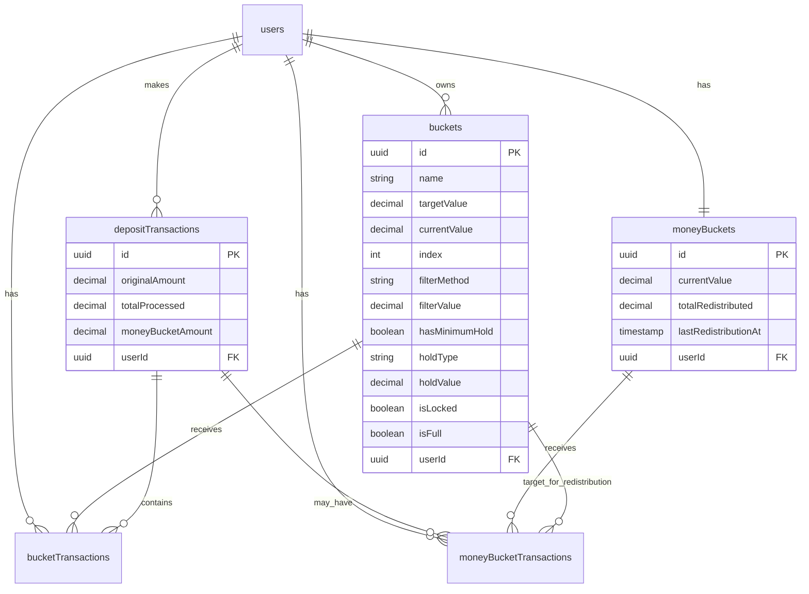

# Database Schema Specification

## Database Entity Relationship Diagram



## Core Tables

### Users Table
```typescript
export const users = pgTable('users', {
  id: uuid('id').defaultRandom().primaryKey(),
  email: varchar('email', { length: 255 }).notNull().unique(),
  passwordHash: varchar('password_hash', { length: 255 }).notNull(),
  name: varchar('name', { length: 255 }).notNull(),
  createdAt: timestamp('created_at').defaultNow().notNull(),
  updatedAt: timestamp('updated_at').defaultNow().notNull(),
})
```

### Buckets Table
```typescript
export const buckets = pgTable('buckets', {
  id: uuid('id').defaultRandom().primaryKey(),
  name: varchar('name', { length: 255 }).notNull(),
  targetValue: decimal('target_value', { precision: 10, scale: 2 }).notNull(),
  currentValue: decimal('current_value', { precision: 10, scale: 2 }).default('0').notNull(),
  index: integer('index').notNull(), // Priority order
  
  // Filter configuration
  filterMethod: varchar('filter_method', { length: 20 }).notNull(), // 'flat_value' | 'percentage'
  filterValue: decimal('filter_value', { precision: 10, scale: 2 }).notNull(),
  
  // Hold configuration
  hasMinimumHold: boolean('has_minimum_hold').default(false).notNull(),
  holdType: varchar('hold_type', { length: 20 }), // 'flat_value' | 'percentage'
  holdValue: decimal('hold_value', { precision: 10, scale: 2 }),
  
  // State flags
  isLocked: boolean('is_locked').default(false).notNull(),
  isFull: boolean('is_full').default(false).notNull(),
  
  userId: uuid('user_id').references(() => users.id, { onDelete: 'cascade' }).notNull(),
  createdAt: timestamp('created_at').defaultNow().notNull(),
  updatedAt: timestamp('updated_at').defaultNow().notNull(),
})
```

### Money Bucket Table
```typescript
export const moneyBuckets = pgTable('money_buckets', {
  id: uuid('id').defaultRandom().primaryKey(),
  currentValue: decimal('current_value', { precision: 10, scale: 2 }).default('0').notNull(),
  totalRedistributed: decimal('total_redistributed', { precision: 10, scale: 2 }).default('0').notNull(),
  lastRedistributionAt: timestamp('last_redistribution_at'),
  userId: uuid('user_id').references(() => users.id, { onDelete: 'cascade' }).notNull(),
  createdAt: timestamp('created_at').defaultNow().notNull(),
  updatedAt: timestamp('updated_at').defaultNow().notNull(),
})
```

### Deposit Transactions Table
```typescript
export const depositTransactions = pgTable('deposit_transactions', {
  id: uuid('id').defaultRandom().primaryKey(),
  originalAmount: decimal('original_amount', { precision: 10, scale: 2 }).notNull(),
  totalProcessed: decimal('total_processed', { precision: 10, scale: 2 }).notNull(),
  moneyBucketAmount: decimal('money_bucket_amount', { precision: 10, scale: 2 }).notNull(),
  userId: uuid('user_id').references(() => users.id, { onDelete: 'cascade' }).notNull(),
  createdAt: timestamp('created_at').defaultNow().notNull(),
})
```

### Bucket Transactions Table
```typescript
export const bucketTransactions = pgTable('bucket_transactions', {
  id: uuid('id').defaultRandom().primaryKey(),
  amount: decimal('amount', { precision: 10, scale: 2 }).notNull(),
  balanceBefore: decimal('balance_before', { precision: 10, scale: 2 }).notNull(),
  balanceAfter: decimal('balance_after', { precision: 10, scale: 2 }).notNull(),
  wasFilled: boolean('was_filled').default(false).notNull(),
  transactionType: varchar('transaction_type', { length: 50 }).notNull(), // 'deposit', 'withdrawal', 'transfer', 'redistribution'
  
  bucketId: uuid('bucket_id').references(() => buckets.id, { onDelete: 'cascade' }).notNull(),
  depositTransactionId: uuid('deposit_transaction_id').references(() => depositTransactions.id, { onDelete: 'cascade' }),
  userId: uuid('user_id').references(() => users.id, { onDelete: 'cascade' }).notNull(),
  createdAt: timestamp('created_at').defaultNow().notNull(),
})
```

### Money Bucket Transactions Table
```typescript
export const moneyBucketTransactions = pgTable('money_bucket_transactions', {
  id: uuid('id').defaultRandom().primaryKey(),
  amount: decimal('amount', { precision: 10, scale: 2 }).notNull(),
  balanceBefore: decimal('balance_before', { precision: 10, scale: 2 }).notNull(),
  balanceAfter: decimal('balance_after', { precision: 10, scale: 2 }).notNull(),
  transactionType: varchar('transaction_type', { length: 50 }).notNull(), // 'deposit', 'redistribution_out'
  
  moneyBucketId: uuid('money_bucket_id').references(() => moneyBuckets.id, { onDelete: 'cascade' }).notNull(),
  depositTransactionId: uuid('deposit_transaction_id').references(() => depositTransactions.id, { onDelete: 'cascade' }),
  targetBucketId: uuid('target_bucket_id').references(() => buckets.id, { onDelete: 'set null' }), // For redistributions
  userId: uuid('user_id').references(() => users.id, { onDelete: 'cascade' }).notNull(),
  createdAt: timestamp('created_at').defaultNow().notNull(),
})
```

## Database Relationships

### Primary Relationships
- **users → buckets** (1:many) - Each user owns multiple buckets
- **users → moneyBuckets** (1:1) - Each user has one money bucket
- **users → depositTransactions** (1:many) - Each user makes multiple deposits
- **depositTransactions → bucketTransactions** (1:many) - Each deposit creates multiple bucket transactions
- **buckets → bucketTransactions** (1:many) - Each bucket receives multiple transactions
- **moneyBuckets → moneyBucketTransactions** (1:many) - Money bucket has transaction history

### Cascade Relationships
- **depositTransactions → bucketTransactions** - When a deposit is processed, it creates multiple bucket transactions
- **depositTransactions → moneyBucketTransactions** - Deposits may also create money bucket transactions for remainder funds
- **buckets → moneyBucketTransactions** (target_bucket_id) - Redistributions target specific buckets

## Key Database Patterns

### Atomic Transaction Processing
All cascade operations are wrapped in database transactions to ensure consistency:
- Deposit creates one `depositTransaction` record
- Multiple `bucketTransaction` records are created atomically
- Money bucket balance is updated atomically
- If any operation fails, entire transaction is rolled back

### Audit Trail
Every financial operation is fully logged:
- **Before/After Balances**: All transactions record balance changes
- **Transaction Types**: Clear categorization of all money movements
- **Timestamps**: Full audit trail with creation timestamps
- **User Attribution**: All transactions linked to user accounts

### State Management
- **Bucket State**: `isFull` and `isLocked` flags manage bucket behavior
- **Money Bucket Tracking**: Total redistributed amount and last redistribution timestamp
- **Priority Ordering**: `index` field manages bucket cascade priority

## Database Indexes

### Performance Indexes
```sql
-- User-based queries
CREATE INDEX idx_buckets_user_id ON buckets(user_id);
CREATE INDEX idx_bucket_transactions_user_id ON bucket_transactions(user_id);
CREATE INDEX idx_deposit_transactions_user_id ON deposit_transactions(user_id);
CREATE INDEX idx_money_bucket_transactions_user_id ON money_bucket_transactions(user_id);

-- Bucket priority ordering
CREATE INDEX idx_buckets_user_priority ON buckets(user_id, index);

-- Transaction date queries
CREATE INDEX idx_bucket_transactions_created_at ON bucket_transactions(created_at);
CREATE INDEX idx_deposit_transactions_created_at ON deposit_transactions(created_at);

-- Bucket transaction lookups
CREATE INDEX idx_bucket_transactions_bucket_id ON bucket_transactions(bucket_id);
CREATE INDEX idx_bucket_transactions_deposit_id ON bucket_transactions(deposit_transaction_id);
```

### Unique Constraints
```sql
-- Ensure unique user email
ALTER TABLE users ADD CONSTRAINT unique_user_email UNIQUE (email);

-- Ensure one money bucket per user
ALTER TABLE money_buckets ADD CONSTRAINT unique_user_money_bucket UNIQUE (user_id);

-- Ensure unique bucket priorities per user
ALTER TABLE buckets ADD CONSTRAINT unique_user_bucket_priority UNIQUE (user_id, index);
```

## Migration Strategy

### Initial Schema
1. Create users table
2. Create buckets table with foreign key to users
3. Create money_buckets table with foreign key to users
4. Create deposit_transactions table
5. Create bucket_transactions table with foreign keys
6. Create money_bucket_transactions table with foreign keys
7. Add indexes for performance
8. Add constraints for data integrity

### Data Seeding
- Create default user for development
- Create sample buckets with various filter configurations
- Create initial money bucket for user
- Generate sample transactions for testing cascade logic