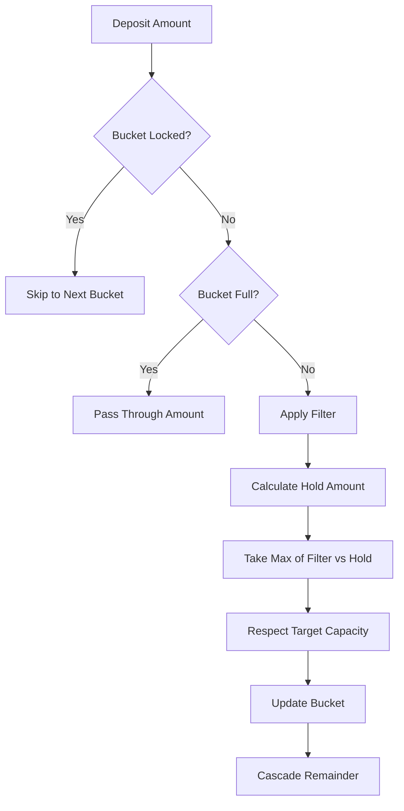
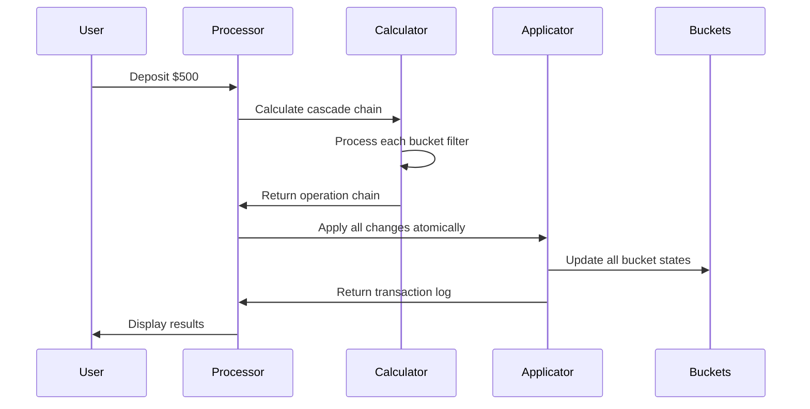
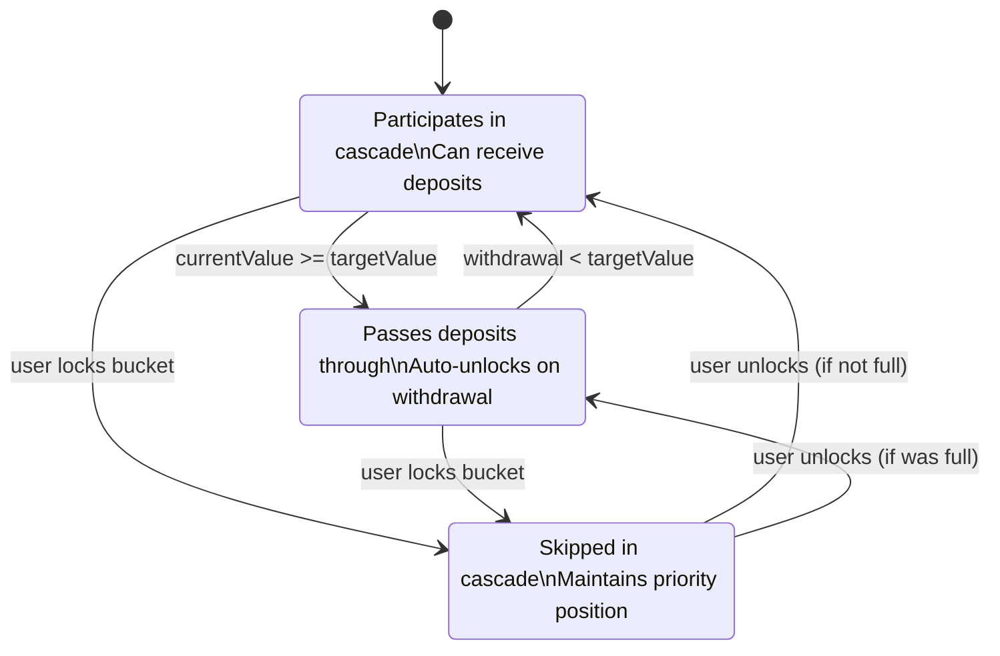

# Domain Model Specification

## Cascading Bucket Algorithm

### Core Business Logic

The application implements a sophisticated cascading bucket system that differs from traditional envelope budgeting. Instead of simple allocation, funds flow through buckets based on configurable filters and hold amounts.

### Bucket Filter System



### Atomic Cascade Processing



### Bucket State Transitions



## Core Entities

```typescript
interface Bucket {
  id: string
  name: string
  targetValue: number
  currentValue: number
  index: number // Priority order (0 = highest priority)
  
  // Filter configuration - how much bucket tries to capture
  filter: {
    method: 'flat_value' | 'percentage'
    value: number // Dollar amount or percentage (0-100)
  }
  
  // Hold configuration - minimum guarantee ("floor")
  hold: {
    hasMinimumHold: boolean
    holdType: 'flat_value' | 'percentage'  
    holdValue: number // Minimum amount bucket will take
  }
  
  // State management
  isLocked: boolean   // Excluded from cascade, maintains position
  isFull: boolean     // Auto-calculated, passes deposits through
  
  // Metadata
  createdAt: Date
  updatedAt: Date
}

interface MoneyBucket {
  currentValue: number
  transactions: Transaction[]
  
  // Redistribution tracking
  lastRedistributionAt?: Date
  totalRedistributed: number
}

interface DepositTransaction {
  id: string
  originalAmount: number
  bucketTransactions: BucketTransaction[]
  moneyBucketAmount: number
  processedAt: Date
  userId: string
}

interface BucketTransaction {
  bucketId: string
  amount: number
  bucketBalanceBefore: number
  bucketBalanceAfter: number
  wasFilled: boolean // True if this transaction filled the bucket
}
```

## Processing Interfaces

```typescript
interface CascadeChain {
  operations: BucketOperation[]
  finalRemainder: number
  totalProcessed: number
}

interface BucketOperation {
  bucketId: string
  amountToAdd: number
  willBeFull: boolean
  filterAmountCalculated: number
  holdAmountCalculated: number
  actualAmountKept: number
}

interface BucketResult {
  kept: number      // Amount bucket retains
  cascaded: number  // Amount passed to next bucket
  reason: 'filter' | 'hold_floor' | 'capacity_limit'
}

interface RedistributionResult {
  transferred: number
  overflow: number
  bucketNowFull: boolean
  remainingMoneyBucketBalance: number
}
```

## Service Layer Architecture

```typescript
interface IBucketDAO {
  findByUserId(userId: string): Promise<Bucket[]>
  findById(id: string): Promise<Bucket | null>
  create(bucket: CreateBucketInput): Promise<Bucket>
  update(id: string, updates: UpdateBucketInput): Promise<Bucket | null>
  delete(id: string): Promise<boolean>
  updatePriorities(reorderData: BucketReorderInput[]): Promise<Bucket[]>
}

interface IDepositProcessor {
  processDeposit(amount: number, buckets: Bucket[]): Promise<DepositResult>
  calculateCascadeChain(amount: number, buckets: Bucket[]): CascadeChain
  applyChanges(cascadeChain: CascadeChain): Promise<Transaction[]>
}

interface IBucketService {
  createBucket(input: CreateBucketInput, userId: string): Promise<Bucket>
  reorderBuckets(userId: string, newOrder: string[]): Promise<Bucket[]>
  lockBucket(bucketId: string): Promise<Bucket>
  unlockBucket(bucketId: string): Promise<Bucket>
  deleteBucket(bucketId: string): Promise<BucketDeletionResult>
  manualDeposit(bucketId: string, amount: number): Promise<BucketTransaction>
}

interface IMoneyBucketService {
  getBalance(userId: string): Promise<number>
  redistributeToSpecificBucket(
    userId: string, 
    amount: number, 
    targetBucketId: string
  ): Promise<RedistributionResult>
  redistributeThroughCascade(
    userId: string, 
    amount: number
  ): Promise<DepositResult>
  getTransactionHistory(userId: string): Promise<MoneyBucketTransaction[]>
}
```

## Cascade Processing Algorithm

```typescript
class DepositProcessor implements IDepositProcessor {
  async processDeposit(amount: number, buckets: Bucket[]): Promise<DepositResult> {
    // Phase 1: Calculate all operations without applying changes
    const cascadeChain = this.calculateCascadeChain(amount, buckets)
    
    // Phase 2: Apply all changes atomically
    const transactions = await this.applyChanges(cascadeChain)
    
    return {
      originalAmount: amount,
      totalProcessed: cascadeChain.totalProcessed,
      remainder: cascadeChain.finalRemainder,
      transactions,
      bucketResults: cascadeChain.operations
    }
  }
  
  calculateCascadeChain(amount: number, buckets: Bucket[]): CascadeChain {
    let remainingAmount = amount
    const operations: BucketOperation[] = []
    
    // Get active buckets in priority order (excluding locked)
    const activeBuckets = buckets
      .filter(b => !b.isLocked)
      .sort((a, b) => a.index - b.index)
    
    for (const bucket of activeBuckets) {
      if (remainingAmount <= 0) break
      
      const operation = this.calculateBucketOperation(bucket, remainingAmount)
      
      if (operation.actualAmountKept > 0) {
        operations.push(operation)
      }
      
      remainingAmount -= operation.actualAmountKept
    }
    
    return {
      operations,
      finalRemainder: remainingAmount,
      totalProcessed: amount - remainingAmount
    }
  }
  
  private calculateBucketOperation(bucket: Bucket, availableAmount: number): BucketOperation {
    if (bucket.isFull) {
      return this.createPassThroughOperation(bucket, availableAmount)
    }
    
    // Calculate filter amount
    const filterAmount = bucket.filter.method === 'flat_value'
      ? Math.min(bucket.filter.value, availableAmount)
      : availableAmount * (bucket.filter.value / 100)
    
    // Calculate hold amount (the "floor")
    const holdAmount = bucket.hold.hasMinimumHold
      ? bucket.hold.holdType === 'flat_value'
        ? bucket.hold.holdValue
        : availableAmount * (bucket.hold.holdValue / 100)
      : 0
    
    // Take the higher of filter vs hold (floor logic)
    const requestedAmount = Math.max(filterAmount, holdAmount)
    
    // Respect bucket capacity
    const spaceAvailable = bucket.targetValue - bucket.currentValue
    const actualAmountKept = Math.min(requestedAmount, spaceAvailable)
    
    return {
      bucketId: bucket.id,
      amountToAdd: actualAmountKept,
      willBeFull: (bucket.currentValue + actualAmountKept) >= bucket.targetValue,
      filterAmountCalculated: filterAmount,
      holdAmountCalculated: holdAmount,
      actualAmountKept
    }
  }
}
```

## Business Rules

### Money Bucket Operations
- **Overflow Collection**: Automatic collection of uncaptured deposit remainders
- **Redistribution Modes**: Both direct transfers to specific buckets and cascade-through processing
- **Balance Management**: Track and display available Money Bucket funds
- **Transfer Controls**: User-initiated redistribution with overflow handling

### Cascading Bucket System
- **Dynamic Filter System**: Buckets use configurable filters (flat value or percentage) to capture funds from each deposit
- **Hold Amount Floor**: Minimum guarantee system where hold amounts override filter amounts when higher
- **Atomic Cascade Processing**: All bucket filters resolve before any state changes are applied
- **Priority-Based Flow**: Deposits cascade through buckets in priority order, with locked buckets maintaining position but being skipped
- **Auto-State Management**: Buckets automatically transition between active/full states based on target values
- **Money Bucket Overflow**: Remainder funds collect in Money Bucket with redistribution capabilities
- **Drag & Drop Reordering**: Dynamic priority management with persistent ordering

### Bucket Management
- **Bucket Creation**: Configure buckets with filter methods, hold amounts, and target values
- **State Transitions**: Automatic state management (active → full → active) based on content and withdrawals
- **Lock/Unlock System**: Temporary exclusion from cascade while maintaining priority position
- **Deletion Handling**: User choice between withdrawal and cascade-through for buckets containing funds
- **Manual Funding**: Direct deposits to specific buckets, bypassing cascade system

### Deposit Processing
- **Cascade Algorithm**: Multi-phase processing with calculation and application phases
- **Filter Application**: Configurable bucket filters determine fund capture amounts
- **Hold Floor Logic**: Minimum hold amounts override filter amounts when higher
- **Remainder Management**: Uncaptured funds flow to Money Bucket for later redistribution
- **Transaction Logging**: Comprehensive audit trail of all fund movements